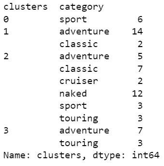

# How to choose adventure motorcycle with K means clustering?
## Introduction

When choosing a motorcycle, we first of all pay attention to its type, what is its purpose - to dissect off-road, participate in races or ride long distances? This is what its type tells us all, as a rule, indicated on the manufacturer's website, according to which we are already conducting a more detailed review.But what if the manufacturer is deceiving us, and the adventure motorcycle is not an adventure bike at all, but a street? Let's figure it out.

**The main goal** of the project is to determine based on the characteristics of the motorcycle its type - adventure, touring, sports or street. A well-known section of data analysis will help us with this - this is classification.We will classify the type of motorcycles using k-means cluster analysis.

##### **The main tasks of the project:**

+ determining what data we need
+ where to get them
+ processing data
+ which variables correlate with each other 
+ performing standardization
+ determining the number of clusters
+ performing clustering by the k-means method
+ I determine in which groups of clusters the type of motorcycle prevails the most, we give it a name
+ creating a separate column for clusters and rename the cluster numbers to the types of motorcycles prevailing in this cluster
+ we identify the mismatch of categories after clustering
+ we conduct a Tukey test to determine the statistical difference of values in groups for each variable
+ drawing conclusions

### _1. Determining what data we need_

In order to understand what data we need to analyze motorcycle categories, it is necessary to assume what each assigned type of motorcycle depends on? I put forward the theory that the main thing for a sports motorcycle is speed, power, streamlined shape. For a touring motorcycle, it is the size of the wheels, volume of the fuel tank, a comfortable fit. And for an adventure motorcycle - ground clearance. But there could be something else, right?

### _2. Where to get them?_

The manuals written by the developers will help determine all possible characteristics of the motorcycle. In them you can find all the characteristics of a motorcycle of each model. For analysis, such motorcycle brands as:

> **suzuki**,  **kawasaki**, **yamaha**, **honda**, **bmw**, **triumph**, **ducati**,  **moto guzzi**,  **aprilia**,  **ktm**. 

Unfortunately, while searching for data, I encountered the problem of the lack of manuals for new models that have not yet been released or published in the public domain, so I found affordable and fresh motorcycle manuals.

After opening the manual, I took from it all the variables that presumably affect the type of motorcycle:

  | variables   | variables   |
  | ----------- | ----------- |
  | make        | tank_range  |
  | model       | wheel_base  |
  | category    | ground_clear|
  | displacement| front_wheel |
  | power_hp    | rear_wheel  |
  | torque_nm   | front_travel|
  | net_weight  | rear_travel |
  | gross_weight| hip_angle   |
  | load_capacity|knee_angle  |
  | seat_height | pw_ratio    |
  |fuel_efficiency| drive_train|
  | fuel_tank   | wheel_type  |
  
Since there are not so many motorcycle models themselves - 65 pieces, and each model has its own manual, it would be very difficult to automate such a process, so I entered the data manually, rechecking them several times. Perhaps, let's move on to the practical part of the study.

### _3. Data processing_

The program in which I will classify data into categories is **Python**.
I am downloading all the necessary packages for analysis. From googlesheet, I open the file immediately in python. This is very convenient, since you do not need to download the file separately to your computer.

In the table I see that the variables **drive_train** and **wheel_type** are categorical and contain text values. It is necessary to convert them to numeric values for further processing. Let's check how many varieties of values exist
in variables:

{ width=50%}

The variable transmission is characterized by two types - **chain** and **shaft**. 
The wheel_type variable is characterized by two types - **cast** and **spoke**.

I convert text values to numeric values by assigning them numbers 0 and 1 and transpose them into separate columns. Since googlesheet uses an automatic format, it is necessary to change the comma to a dot in the column values.

In addition, it can be seen that some variables have the wrong format - **object**. These are just decimal numbers. There is a **float** format for such numbers. Let's change the format of these variables. This is part of the data processing.

Before determining which variables correlate with each other, it is necessary to look at the distribution of variables. Descriptive statistics will help with this. The table shows that almost all variables have a distribution close to normal.  Variation is within the normal range.

{ width=50% }

### _4. Correlation matrix_

The next step in data processing is to see how the variables correlate with each other. Strongly correlated variables give the model the same information, therefore, it is not necessary to use them all for analysis. As a parameter I set the correlation above **+-0.65**. The table shows that variables such as **displacement**, **torque_nm**, **gross_weight**, **fuel_efficiency**, **front_wheel**, **knee_angle**, **pw_ratio**, **shaft**, **cast**, **spoke** have a strong correlation with other variables. For example, **torque_nm** correlates with **power_hp** and **displacement** and we'd better leave **power_hp** as the variable under study because **power** is much easier to understand than **torque** or engine **displacement**. It is also better for us to abandon  **gross_weight** in favor of other more precise variables. **Cast** and **spoke** are categorical variables and they correlate with **ground_clearance**. **Ground_clearance** is a more valuable variable, since it tells us how high the motorcycle is, whether it is possible to ride it off the roads, so we leave it. Thus, I selected variables for the next stage of data processing - standardization.

I select the necessary columns for standardization - these are all the remaining uncorrelated variables: **power_hp**, **net_weight**, **load_capacity**, **seat_height**, **fuel_tank**, **tank_range**, **wheel_base**, **ground_clear**, **front_travel**, **rear_wheel**, **rear_travel**, **hip_angle**, **chain**. I perform standardization using the _scikit-learn library_.

### _5. Determining the number of clusters_

After we have brought the data to a general form, we can proceed to classification. Before building a model, it is necessary to understand how many clusters are needed for analysis.

There are many methods for determining the number of clusters - _gap statistical method_, _silhouette method_, _Elbows method_. However, after trying different methods, I settled on the _Elbow method_. He showed me **4** clusters. With the help of the visualization, you can see on the graph how it turned out:

{ width=50% }

### _6. Performing clustering by the k-means method_ 

I perform clustering and plot clusters to see the distribution of our data around the clusters. In this case, let's take the variables **power** and **net_weight**. The graph shows that the **2** clusters are quite close to each other and the main sample is closest to them compared to the other two centroids. 

Let's look at the size and inertia of clusters, the better the clustering effect, the lower the inertia. There are **6** objects in the first cluster; **16** objects in the second cluster, **32** in the third, **10** in the fourth.

{ width=50% }

I attach clusters to the database to understand which cluster numbers correspond to which objects. Now it is possible to see in which category of clusters which types of motorcycles are present the most:

 

> + for the first cluster - **sport**;
  + for the second cluster - **adventure**;
  + for the third cluster - **street**;
  + for the fourth cluster - **touring**.

### _7. Identification of category mismatch after clustering_ 

Thus, we have formed **4** clusters with the names of motorcycle types. In order to find discrepancies in the categories of motorcycles, it is necessary to create a new column - new_category, in which we change the cluster number to the name. It was determined above by the largest type of motorcycles in each cluster.

12 discrepancies were detected during clustering, the results can be seen in the [**table**](mismatched_types_moto.csv).

Such motorcycle models as: 

  |     make    |     model   |
  | ----------- | ----------- |
  | honda       | xadv        |
  | honda       | nc750x      |
  | honda       | cb500x      |
  | bmw         | f750gs      |
  | triumph     | tigersport660|

They were identified by the manufacturer in the _adventure_ category, but clustering identified them in the _street_ group.

Such motorcycle models as: 

  |    make     |    model    |
  | ----------- | ----------- |
  | kawasaki    | versys1000  |
  | bmw         | r1250gs     |
  | triumph     | tiger1200xr |
  | triumph     | tiger1200rally|
  | motoguzzi   | v85tt       |
  | aprilia     | tuareg660   |
  | ktm         | supaeradventures1290|

They were identified by the manufacturer in the _adventure_ category, but clustering identified them in the _touring_ group.

### _8. Tukey test_

Let's run Tukey test for each variable that we took for clustering to see if there is a statistically significant difference in the values in the groups. During the test, a statistically significant difference in the groups was revealed in the variables:

> **power_hp**, **load_capacity**, **fuel_tank**, **wheel_base**, **ground_clear**, **hip_angle**.

Thus, the most important influences on the type of motorcycle in each group are **power**, **load capacity**, **fuel tank**, **wheelbase**, **ground clearance** and **hip angle**. It turns out that not all motorcycles are suitable for adventure and off-road driving. 
As it turned out, they can be designed for tourist trips on asphalt or in everything for driving around the city. Now you know by what parameters to check the type of motorcycle from the manufacturer. And then it's up to you to decide who to believe)

